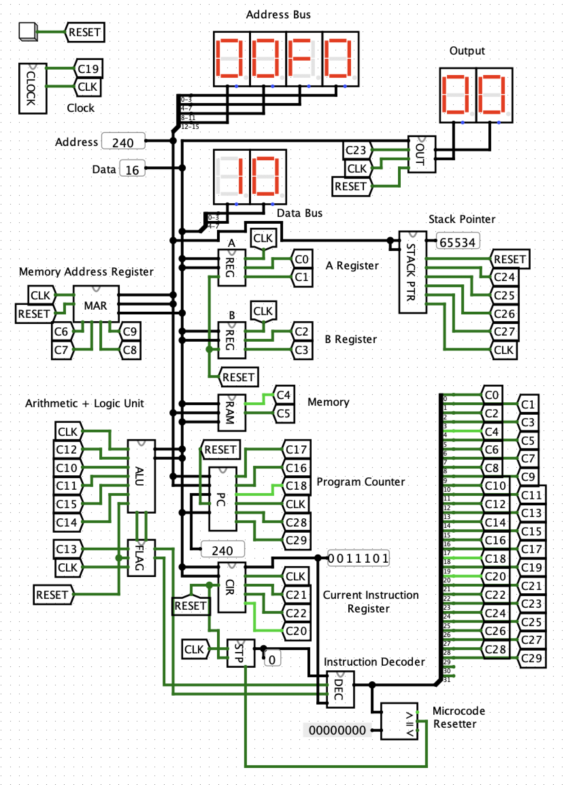

# Computer

These are the schematics for an 8-bit computer I'm designing, loosely based on [Ben Eater's YouTube series](https://www.youtube.com/playlist?list=PLowKtXNTBypGqImE405J2565dvjafglHU).

There's a pdf version of the schematics [here](schematic.pdf), although it might not always be up to date. Otherwise, you can open the project in [Kicad](http://kicad-pcb.org/).

I've also recreated the schematics in [Logisim](http://www.cburch.com/logisim/), to test that it all works properly before I build it in real life. You can download the Logisim file [here](simulation/computer.circ).

